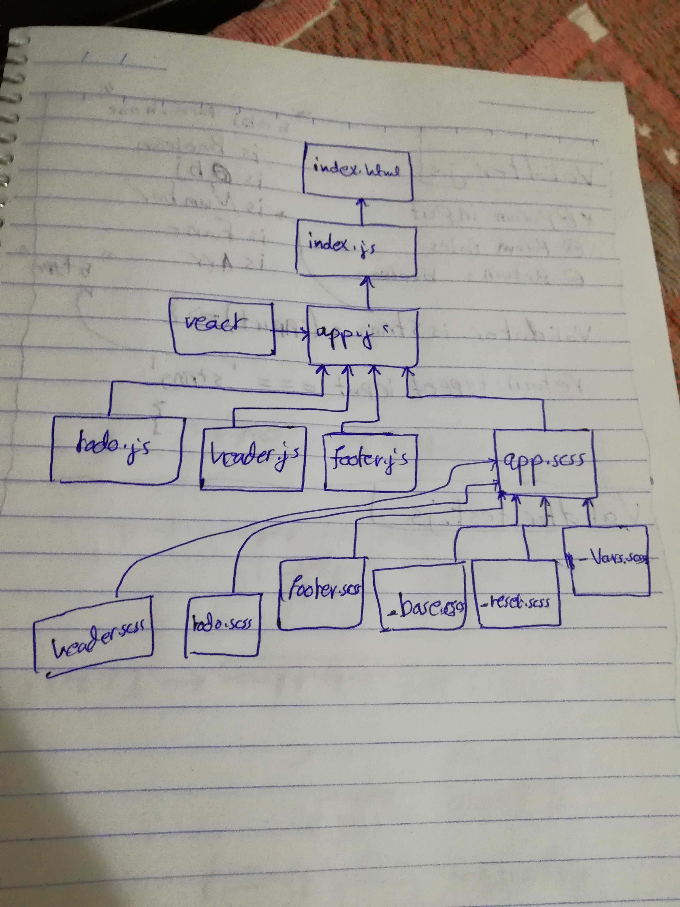

# LAB - Class 31

## Hooks API

### Author: Ahmad K. Al-Mahasneh

### Links and Resources

- [submission PR](https://github.com/401-advanced-javascript-AhmadK/hooks-api/pull/1)
- [ci/cd](https://github.com/401-advanced-javascript-AhmadK/hooks-api/actions) (GitHub Actions)
- [netlify](https://eager-bartik-2e9268.netlify.com)

#### How to initialize/run your application (where applicable)

- `npm run build`
- `npm run start`

#### Tests

- How do you run tests?
    `npm run test`
- Any tests of note?
    Snapshot Test
- Describe any tests that you did not complete, skipped, etc
    all passed

#### UML

